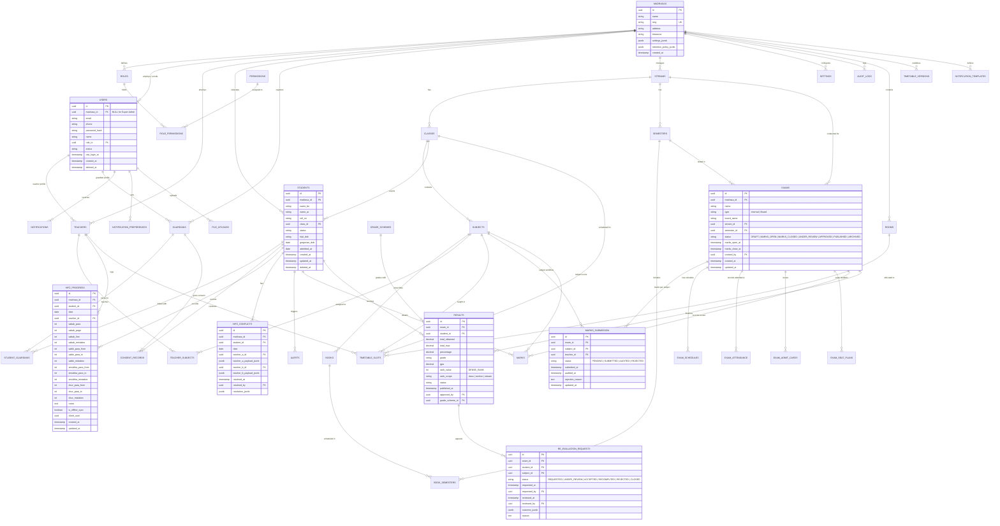

# Entity Relationship Diagram (ERD) — MadrasaOS AI v3.0

```mermaid
erDiagram
    %% TENANCY & IDENTITY
    MADRASAS ||--o{ ROLES : "defines"
    MADRASAS ||--o{ USERS : "employs / enrolls"
    MADRASAS ||--o{ TEACHERS : "employs"
    MADRASAS ||--o{ STUDENTS : "educates"
    MADRASAS ||--o{ GUARDIANS : "registers"
    MADRASAS ||--o{ STREAMS : "manages"
    MADRASAS ||--o{ SETTINGS : "configures"
    MADRASAS ||--o{ AUDIT_LOGS : "logs"

    ROLES ||--o{ ROLE_PERMISSIONS : "holds"
    PERMISSIONS ||--o{ ROLE_PERMISSIONS : "assigned to"
    USERS ||--o{ TEACHERS : "teacher profile"
    USERS ||--o{ GUARDIANS : "guardian profile"

    %% ACADEMIC STRUCTURE
    STREAMS ||--o{ CLASSES : "has"
    STREAMS ||--o{ SEMESTERS : "has"
    CLASSES ||--o{ SUBJECTS : "contains"
    CLASSES ||--o{ STUDENTS : "enrolls"
    SUBJECTS ||--o{ BOOKS : "prescribes"
    SUBJECTS ||--o{ TEACHER_SUBJECTS : "assigned to"
    TEACHERS ||--o{ TEACHER_SUBJECTS : "teaches"

    BOOKS ||--o{ BOOK_SEMESTERS : "scheduled in"
    SEMESTERS ||--o{ BOOK_SEMESTERS : "includes"

    %% STUDENTS & GUARDIANS
    STUDENTS ||--o{ STUDENT_GUARDIANS : "linked with"
    GUARDIANS ||--o{ STUDENT_GUARDIANS : "cares for"
    STUDENTS ||--o{ CONSENT_RECORDS : "records"
    GUARDIANS ||--o{ CONSENT_RECORDS : "gives consent"

    %% HIFZ DEPARTMENT
    STUDENTS ||--o{ HIFZ_PROGRESS : "records"
    TEACHERS ||--o{ HIFZ_PROGRESS : "logs"
    STUDENTS ||--o{ HIFZ_CONFLICTS : "has"
    STUDENTS ||--o{ ALERTS : "triggers"

    %% TIMETABLE
    MADRASAS ||--o{ ROOMS : "contains"
    CLASSES ||--o{ TIMETABLE_SLOTS : "scheduled for"
    ROOMS ||--o{ TIMETABLE_SLOTS : "allocated to"
    SUBJECTS ||--o{ TIMETABLE_SLOTS : "taught in"
    TEACHERS ||--o{ TIMETABLE_SLOTS : "conducts"
    MADRASAS ||--o{ TIMETABLE_VERSIONS : "publishes"

    %% EXAMS & RESULTS
    SEMESTERS ||--o{ EXAMS : "tested in"
    STREAMS ||--o{ EXAMS : "conducted for"
    EXAMS ||--o{ MARKS_SUBMISSION : "tracks per-subject"
    SUBJECTS ||--o{ MARKS_SUBMISSION : "subject workflow"
    EXAMS ||--o{ EXAM_SCHEDULES : "has schedule"
    EXAMS ||--o{ EXAM_ATTENDANCE : "records attendance"
    EXAMS ||--o{ EXAM_ADMIT_CARDS : "issues"
    EXAMS ||--o{ EXAM_SEAT_PLANS : "seats students"
    EXAMS ||--o{ MARKS : "records scores"
    STUDENTS ||--o{ MARKS : "obtains"
    SUBJECTS ||--o{ MARKS : "subject score"
    GRADE_SCHEMES ||--o{ RESULTS : "grades with"
    EXAMS ||--o{ RESULTS : "finalizes"
    STUDENTS ||--o{ RESULTS : "receives"
    RESULTS ||--o{ RE_EVALUATION_REQUESTS : "appeals"

    %% NOTIFICATIONS & FILES
    MADRASAS ||--o{ NOTIFICATION_TEMPLATES : "defines"
    USERS ||--o{ NOTIFICATIONS : "receives"
    USERS ||--o{ NOTIFICATION_PREFERENCES : "sets"
    USERS ||--o{ FILE_UPLOADS : "uploads"

    %% ENTITY ATTRIBUTES
    MADRASAS {
        uuid id PK
        string name
        string slug UK
        string address
        string timezone
        jsonb settings_jsonb
        jsonb retention_policy_jsonb
        timestamp created_at
    }

    USERS {
        uuid id PK
        uuid madrasa_id FK "NULL for Super Admin"
        string email
        string phone
        string password_hash
        string name
        uuid role_id FK
        string status
        timestamp last_login_at
        timestamp created_at
        timestamp deleted_at
    }

    STUDENTS {
        uuid id PK
        uuid madrasa_id FK
        string name_bn
        string name_ar
        string roll_no
        uuid class_id FK
        string status
        string hijri_dob
        date gregorian_dob
        date admitted_at
        timestamp created_at
        timestamp updated_at
        timestamp deleted_at
    }

    HIFZ_PROGRESS {
        uuid id PK
        uuid madrasa_id FK
        uuid student_id FK
        date date
        uuid teacher_id FK
        int sabak_para
        int sabak_page
        int sabak_line
        int sabak_mistakes
        int sabki_para_from
        int sabki_para_to
        int sabki_mistakes
        int amukhta_para_from
        int amukhta_para_to
        int amukhta_mistakes
        int dour_para_from
        int dour_para_to
        int dour_mistakes
        text notes
        boolean is_offline_sync
        uuid client_uuid
        timestamp created_at
        timestamp updated_at
    }

    HIFZ_CONFLICTS {
        uuid id PK
        uuid madrasa_id FK
        uuid student_id FK
        date date
        uuid teacher_a_id FK
        jsonb teacher_a_payload_jsonb
        uuid teacher_b_id FK
        jsonb teacher_b_payload_jsonb
        timestamp resolved_at
        uuid resolved_by FK
        jsonb resolution_jsonb
    }

    EXAMS {
        uuid id PK
        uuid madrasa_id FK
        string name
        string type "Internal | Board"
        string board_name
        uuid stream_id FK
        uuid semester_id FK
        string status "DRAFT | MARKS_OPEN | MARKS_CLOSED | UNDER_REVIEW | APPROVED | PUBLISHED | ARCHIVED"
        timestamp marks_open_at
        timestamp marks_close_at
        uuid created_by FK
        timestamp created_at
        timestamp updated_at
    }

    MARKS_SUBMISSION {
        uuid id PK
        uuid exam_id FK
        uuid subject_id FK
        uuid teacher_id FK
        string status "PENDING | SUBMITTED | AUDITED | REJECTED"
        timestamp submitted_at
        timestamp audited_at
        text rejection_reason
        timestamp updated_at
    }

    RESULTS {
        uuid id PK
        uuid exam_id FK
        uuid student_id FK
        decimal total_obtained
        decimal total_max
        decimal percentage
        string grade
        decimal gpa
        int rank_value "DENSE_RANK"
        string rank_scope "class | section | stream"
        string status
        timestamp published_at
        uuid approved_by FK
        uuid grade_scheme_id FK
    }

    RE_EVALUATION_REQUESTS {
        uuid id PK
        uuid exam_id FK
        uuid student_id FK
        uuid subject_id FK
        string status "REQUESTED | UNDER_REVIEW | ACCEPTED | RECOMPUTED | REJECTED | CLOSED"
        timestamp requested_at
        uuid requested_by FK
        timestamp reviewed_at
        uuid reviewed_by FK
        jsonb outcome_jsonb
        text reason
    }
```
